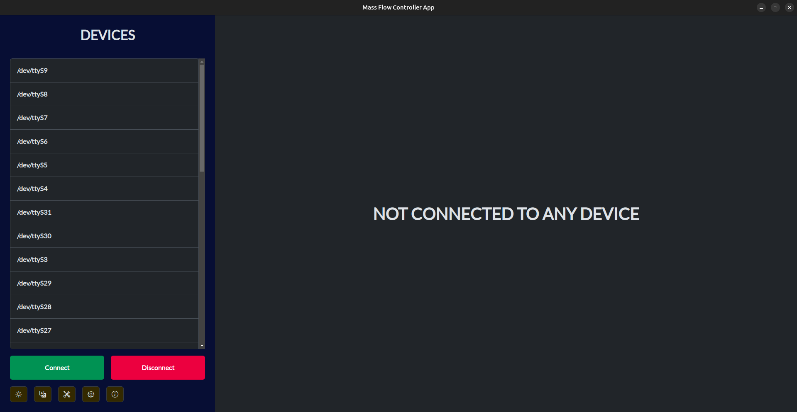
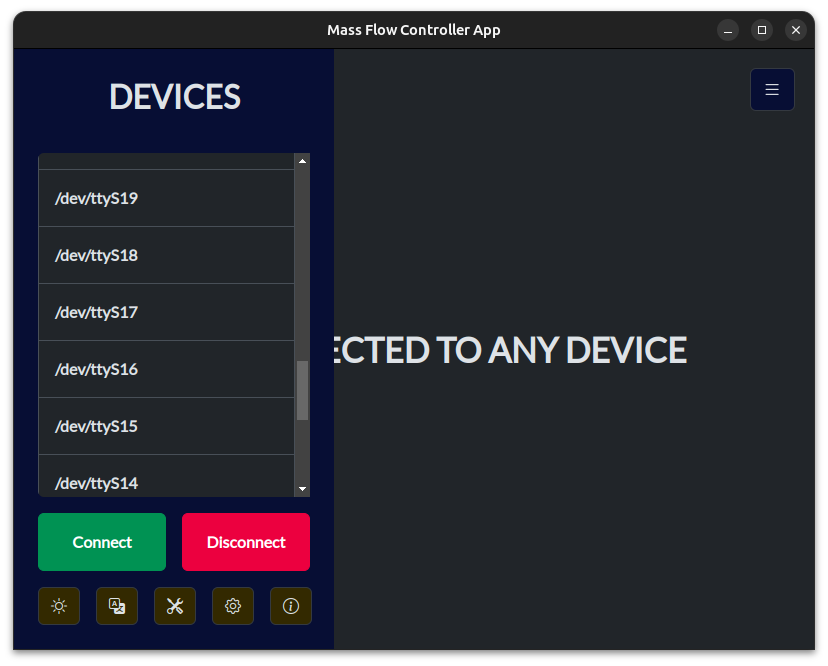

# Mass Flow Controller App

## Status

* Worki in progress

## How to compile

1. Go to `app` folder
2. Run `yarn install`
3. Next run some command below: 
    * `yarn electron-builder --win` for Windows;
    * `yarn electron-builder --linux rpm` for systems like Fedora/RPM;
    * `yarn electron-builder --linux deb` for systems like Ubuntu/Debian;
    * `yarn electron-builder --linux AppImage` for an universal AppImage;
    * `yarn electron-builder --linux tar.xz` for systems like Ubuntu/Debian;
4. After the build, you have an installator!

## Requirements for developing/debug the app
* Node.js
* npm
* yarn

## Used in the project
* Bootstrap
* Serialport.io
* and much more... (others are included in package.js)

## Screenshots

